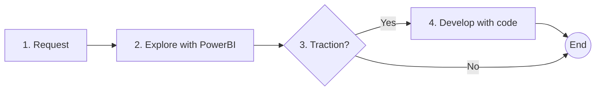

There's a data analyst and a few developers in my team. I used to think that our general idea for data exploration and analysis would be like this:

1. Start with a request or idea for an area that needs data analysis, or a hypotheses that needs to be investigated. This can come either from stakeholders or business analysts.
2. Explore the idea using Power BI
3. Assess the traction of this perspective. The frequency and value that we need to look again.
4. If it's worth it, develop the dashboard using code for more control, flexibility, and automation.

But that was before AI boom. I mean the bigger boom it's been undergoing as of the time of writing, relative to just 1 year ago. Now, it's starting to prove irrelevant, simply due to speed.

Particularly, the speed of developers spinning up more bespoke, flexible, and interesting data visualizations with the help of AI coding assistants. Right now Claude Opus 4.6 is the peak. I noticed one of the key bottlenecks was stitching database tables and fields together. With PowerBI, we'd typically need to do a bunch of clicks, custom formulas, even having to write Power Query code.. Might as well write in Python, in our native application code language!

Our data analyst can't keep up with coding, not even with AI assistants. This is a lot about her capability to pickup new things, and our support for her growth and development, which is another story.

Regardless, this is an alarming phase for her career. Not just PowerBI is being phased out, but with how things are going on right now, her current role is also at risk.