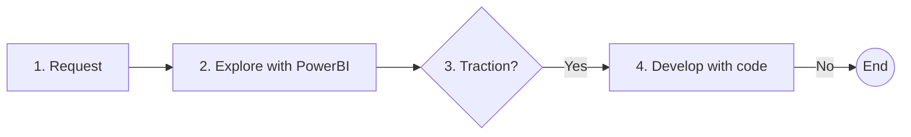

There's a data analyst and a few developers in my team. I used to think that our general idea for data exploration and analysis would be like this:

1. Start with a request or idea for an area that needs data analysis, or a hypotheses that needs to be investigated. This can come either from stakeholders or business analysts.
2. Explore the idea using Power BI
3. Assess the traction of this perspective. The frequency and value that we need to look again.
4. If it's worth it, develop the dashboard using code for more control, flexibility, and automation.

But that was before AI boom. I mean the bigger boom it's been undergoing as of the time of writing, relative to just 1 year ago.