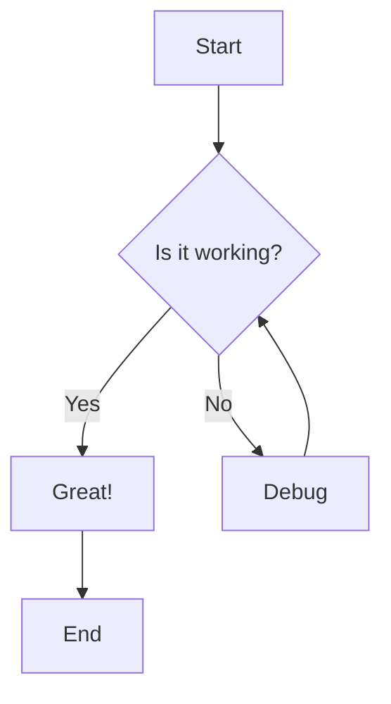
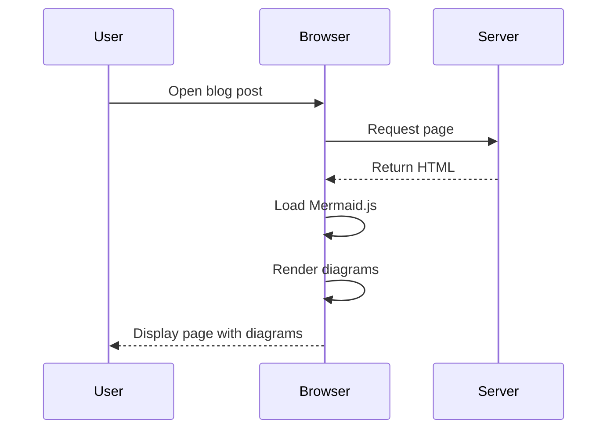

This blog now supports Mermaid.js diagrams! Here are some examples:

## Flowchart

```mermaid
graph TD
    A[Start] --> B{Is it working?}
    B -->|Yes| C[Great!]
    B -->|No| D[Debug]
    D --> B
    C --> E[End]
```

## Sequence Diagram

```mermaid
sequenceDiagram
    participant User
    participant Browser
    participant Server

    User->>Browser: Open blog post
    Browser->>Server: Request page
    Server-->>Browser: Return HTML
    Browser->>Browser: Load Mermaid.js
    Browser->>Browser: Render diagrams
    Browser-->>User: Display page with diagrams
```

Pretty cool, right? You can now include interactive diagrams in any blog post!
